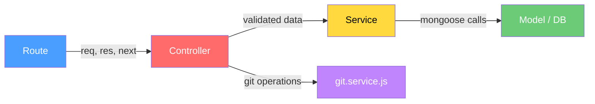

# VersionVista — Modular Architecture Refactor

## Current State Analysis

### Project Structure (as-is)
```
backend/
├── server.js                          ← Entry point (has inline route + logic)
├── src/
│   ├── config/db.js                   ← MongoDB connection
│   ├── modules/
│   │   ├── repo/repo.model.js         ← Mongoose schema only
│   │   ├── commit/commit.model.js     ← Mongoose schema only
│   │   ├── diff/diff.model.js         ← Mongoose schema only
│   │   └── file_change/file_change.model.js  ← Mongoose schema only
│   ├── routes/repo.routes.js          ← 1 route, calls git.service directly
│   └── services/git.service.js        ← 🔴 152-line MONOLITH (clone + save repos, commits, file_changes, diffs)
```

### Key Problems

| # | Problem | Where |
|---|---------|-------|
| 1 | **God function** — `processRepo()` does cloning, commit fetching, file-change saving, and diff parsing all in one 120-line function | [git.service.js](file:///home/prayag/coding/Project/VersionVista/backend/src/services/git.service.js) |
| 2 | **Route defined inline in server.js** — the `POST /api/repo/fetch` handler is duplicated: once in `server.js` (L13-29) and once in `repo.routes.js`, but `server.js` never uses the router | [server.js](file:///home/prayag/coding/Project/VersionVista/backend/server.js#L13-L29) |
| 3 | **No controller layer** — route handler directly calls service; no request validation, no response shaping | [repo.routes.js](file:///home/prayag/coding/Project/VersionVista/backend/src/routes/repo.routes.js) |
| 4 | **No error handling middleware** — each route catches errors independently with `console.error` | [server.js](file:///home/prayag/coding/Project/VersionVista/backend/server.js#L25-L28) |
| 5 | **Shared `routes/` and `services/` dirs sit outside modules** — breaks module encapsulation | Project structure |
| 6 | **No dev script** — no `nodemon` or `--watch` for development | [package.json](file:///home/prayag/coding/Project/VersionVista/backend/package.json) |
| 7 | **No `.env.example`** — new contributors won't know which env vars are needed | Missing file |

---

## Proposed Architecture (to-be)

```
backend/
├── server.js                              ← Clean: just app setup + middleware + route mounting
├── .env.example                           ← [NEW] Documents required env vars
├── src/
│   ├── config/db.js                       ← Unchanged
│   ├── middleware/
│   │   └── errorHandler.js                ← [NEW] Centralized error handling
│   ├── modules/
│   │   ├── repo/
│   │   │   ├── repo.model.js              ← Unchanged
│   │   │   ├── repo.service.js            ← [NEW] DB operations for Repo
│   │   │   ├── repo.controller.js         ← [NEW] Request handling + response shaping
│   │   │   └── repo.routes.js             ← [MOVED from src/routes/]
│   │   ├── commit/
│   │   │   ├── commit.model.js            ← Unchanged
│   │   │   ├── commit.service.js          ← [NEW] DB operations for Commit
│   │   │   └── commit.controller.js       ← [NEW] Request handling
│   │   ├── diff/
│   │   │   ├── diff.model.js              ← Unchanged
│   │   │   ├── diff.service.js            ← [NEW] DB operations for Diff
│   │   │   └── diff.controller.js         ← [NEW] Request handling
│   │   └── file_change/
│   │       ├── file_change.model.js       ← Unchanged
│   │       ├── file_change.service.js     ← [NEW] DB operations for FileChange
│   │       └── file_change.controller.js  ← [NEW] Request handling
│   ├── routes/
│   │   └── index.js                       ← [NEW] Centralized route aggregator
│   └── services/
│       └── git.service.js                 ← [REFACTORED] Only git operations (clone, log, diff, show)
```

### Layered Responsibility



| Layer | Responsibility | Knows about HTTP? |
|-------|---------------|-------------------|
| **Route** | Maps URL → controller method, applies middleware | Yes |
| **Controller** | Validates request, calls service(s), shapes response | Yes |
| **Service** | Business logic + DB operations (CRUD) | ❌ No |
| **Model** | Schema definition, indexes, virtuals | ❌ No |
| **git.service** | Pure git operations (clone, log, diffSummary, show) | ❌ No |

---

## Proposed Changes

### 1. Middleware — Error Handler

#### [NEW] [errorHandler.js](file:///home/prayag/coding/Project/VersionVista/backend/src/middleware/errorHandler.js)

Centralized Express error-handling middleware. All controllers will use `next(err)` instead of manual try/catch response logic.

```js
// Catches all errors thrown/passed via next(err)
// Returns consistent JSON: { success: false, error: "message" }
// Logs full error in dev, sanitizes in production
```

---

### 2. Git Service — Slim Down to Pure Git Operations

#### [MODIFY] [git.service.js](file:///home/prayag/coding/Project/VersionVista/backend/src/services/git.service.js)

Strip out **all** Mongoose imports and DB operations. Keep only:

- `cloneRepo(repoUrl)` → clones repo to disk, returns `{ repoName, repoPath }`
- `getCommitLog(repoPath, maxCount)` → returns raw commit log array
- `getDiffSummary(repoPath, hash)` → returns diff summary for a commit
- `getRawDiff(repoPath, hash)` → returns parsed diff hunks per file

This makes `git.service.js` a **pure data-source adapter** — no DB coupling.

---

### 3. Repo Module

#### [NEW] [repo.service.js](file:///home/prayag/coding/Project/VersionVista/backend/src/modules/repo/repo.service.js)

Database operations for the Repo collection:
- `findByGithubUrl(url)` — find existing repo
- `createRepo({ name, owner, githubUrl })` — create new repo doc
- `findOrCreate(url, name)` — upsert pattern used during processing
- `getAllRepos()` — list all tracked repos
- `getRepoById(id)` — get single repo by ID

#### [NEW] [repo.controller.js](file:///home/prayag/coding/Project/VersionVista/backend/src/modules/repo/repo.controller.js)

Handles HTTP requests:
- `fetchAndProcess(req, res, next)` — validates `repoUrl` from body, orchestrates the full pipeline (clone → save repo → save commits → save file changes → save diffs) by calling services from all modules
- `listRepos(req, res, next)` — returns all tracked repos
- `getRepo(req, res, next)` — returns single repo by ID

#### [MOVED + MODIFIED] [repo.routes.js](file:///home/prayag/coding/Project/VersionVista/backend/src/modules/repo/repo.routes.js)

Moved from `src/routes/` into the module. Routes:
- `POST /fetch` → `repoController.fetchAndProcess`
- `GET /` → `repoController.listRepos`
- `GET /:id` → `repoController.getRepo`

---

### 4. Commit Module

#### [NEW] [commit.service.js](file:///home/prayag/coding/Project/VersionVista/backend/src/modules/commit/commit.service.js)

- `findByHashAndRepo(hash, repoId)` — check for duplicate
- `createCommit(data)` — save a single commit
- `bulkCreateCommits(dataArray)` — batch insert (performance optimization)
- `getCommitsByRepoId(repoId, options)` — paginated list of commits for a repo
- `getCommitById(id)` — single commit with populated repo info

#### [NEW] [commit.controller.js](file:///home/prayag/coding/Project/VersionVista/backend/src/modules/commit/commit.controller.js)

- `listCommits(req, res, next)` — `GET /api/commits?repoId=xxx&page=1&limit=20`
- `getCommit(req, res, next)` — `GET /api/commits/:id`

---

### 5. Diff Module

#### [NEW] [diff.service.js](file:///home/prayag/coding/Project/VersionVista/backend/src/modules/diff/diff.service.js)

- `createDiff(data)` — save a single diff document
- `bulkCreateDiffs(dataArray)` — batch insert
- `getDiffsByCommitId(commitId)` — get all diffs for a commit
- `getDiffById(id)` — single diff

#### [NEW] [diff.controller.js](file:///home/prayag/coding/Project/VersionVista/backend/src/modules/diff/diff.controller.js)

- `listDiffs(req, res, next)` — `GET /api/diffs?commitId=xxx`
- `getDiff(req, res, next)` — `GET /api/diffs/:id`

---

### 6. File Change Module

#### [NEW] [file_change.service.js](file:///home/prayag/coding/Project/VersionVista/backend/src/modules/file_change/file_change.service.js)

- `createFileChange(data)` — save a single file change
- `bulkCreateFileChanges(dataArray)` — batch insert
- `getFileChangesByCommitId(commitId)` — list changes for a commit
- `getFileChangesByRepoId(repoId)` — list changes for a repo

#### [NEW] [file_change.controller.js](file:///home/prayag/coding/Project/VersionVista/backend/src/modules/file_change/file_change.controller.js)

- `listFileChanges(req, res, next)` — `GET /api/file-changes?commitId=xxx`

---

### 7. Route Aggregator

#### [NEW] [routes/index.js](file:///home/prayag/coding/Project/VersionVista/backend/src/routes/index.js)

Single file that imports all module routes and mounts them:
```js
router.use("/repo", repoRoutes);
router.use("/commits", commitRoutes);
router.use("/diffs", diffRoutes);
router.use("/file-changes", fileChangeRoutes);
```

#### [DELETE] [routes/repo.routes.js](file:///home/prayag/coding/Project/VersionVista/backend/src/routes/repo.routes.js)

Replaced by module-local route file + centralized aggregator.

---

### 8. Server Entry Point

#### [MODIFY] [server.js](file:///home/prayag/coding/Project/VersionVista/backend/server.js)

Clean up to:
- Remove inline route handler (L13-29)
- Mount routes via `app.use("/api", require("./src/routes"))`
- Add error handler middleware at the end
- Keep health check route

---

### 9. Developer Experience

#### [MODIFY] [package.json](file:///home/prayag/coding/Project/VersionVista/backend/package.json)

- Add `nodemon` as devDependency
- Add scripts: `"dev": "nodemon server.js"`, `"start": "node server.js"`

#### [NEW] [.env.example](file:///home/prayag/coding/Project/VersionVista/backend/.env.example)

```env
PORT=5000
MONGO_URI=mongodb://localhost:27017/versionvista
```

---

## User Review Required

> [!IMPORTANT]
> **Orchestration location** — The `processRepo` pipeline (clone → save repo → save commits → save file changes → save diffs) currently lives in `git.service.js`. In the refactored version, I plan to move this orchestration logic into `repo.controller.js` since it's the entry point that coordinates across all 4 module services. Alternatively, we could create a dedicated `src/services/pipeline.service.js` to keep the controller thin. **Which approach do you prefer?**

> [!IMPORTANT]
> **New API endpoints** — The plan adds read endpoints (`GET /api/commits`, `GET /api/diffs`, etc.) to make the data queryable. These are not strictly needed for the modularization task but are natural additions since we're creating controllers anyway. **Should I include these, or keep it strictly to the existing fetch/process flow?**

## Open Questions

1. **Pagination** — For listing commits, diffs, etc., should I implement cursor-based or offset-based pagination? (I'd recommend offset-based with `page` + `limit` query params for simplicity.)

2. **Route file per module** — Currently only `repo` has routes. The plan adds routes to `commit`, `diff`, and `file_change` modules too (for GET endpoints). If you don't want read APIs yet, I can skip the routes/controllers for those modules and only create their service files.

3. **Owner extraction** — Currently `owner` is hardcoded as `"unknown"`. Should I parse it from the GitHub URL (e.g., `github.com/prayag/repo` → owner = `prayag`)?

---

## Additional Suggestions

> [!TIP]
> ### Short-Term Improvements (Recommended now)
> 1. **Custom `AppError` class** — Throw errors with HTTP status codes from services/controllers, caught by the error handler middleware
> 2. **Request validation** — Add a lightweight validation function (or use `express-validator`) to validate `repoUrl` format before processing
> 3. **Async handler wrapper** — A small `asyncHandler(fn)` utility to avoid repetitive try/catch in every controller
> 4. **Extract owner from GitHub URL** — Parse `github.com/:owner/:repo` instead of hardcoding `"unknown"`

> [!TIP]
> ### Medium-Term Improvements (Next iteration)
> 1. **Queue-based processing** — Use Bull/BullMQ to process repos asynchronously; return a job ID immediately and let the client poll for status
> 2. **Webhook support** — Accept GitHub webhooks to auto-process new pushes
> 3. **Caching** — Cache git operations (commit logs, diffs) to avoid re-cloning/re-parsing
> 4. **Rate limiting** — Add `express-rate-limit` to prevent abuse of the fetch endpoint
> 5. **Logging** — Replace `console.log/error` with a structured logger (e.g., `winston` or `pino`)

---

## Verification Plan

### Automated Tests
1. Start the server with `npm run dev` and verify it boots without errors
2. Test `POST /api/repo/fetch` with a sample GitHub repo URL and confirm data is saved to MongoDB
3. Test new GET endpoints (`/api/repo`, `/api/commits?repoId=...`, etc.) to verify data retrieval
4. Verify error handling by sending invalid requests (missing URL, bad repo URL)

### Manual Verification
1. Check MongoDB collections to confirm data integrity matches current behavior
2. Verify that re-processing the same repo doesn't create duplicate entries
3. Confirm the modular file structure matches the proposed architecture
